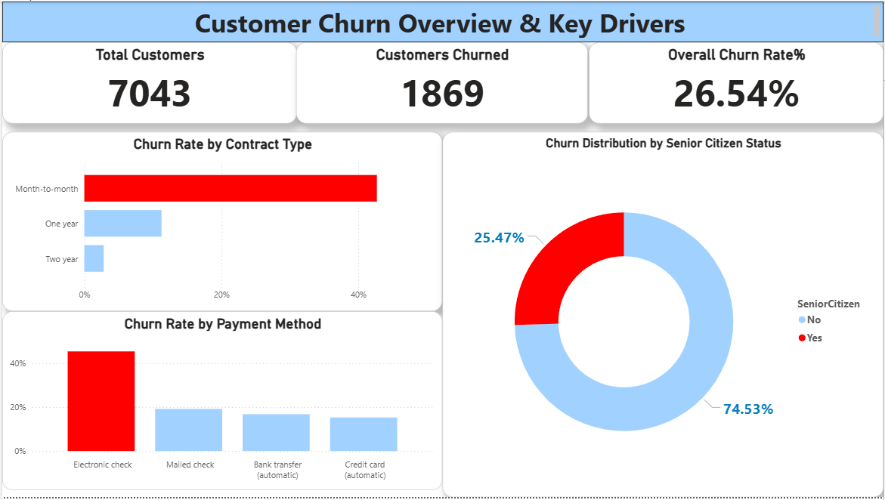
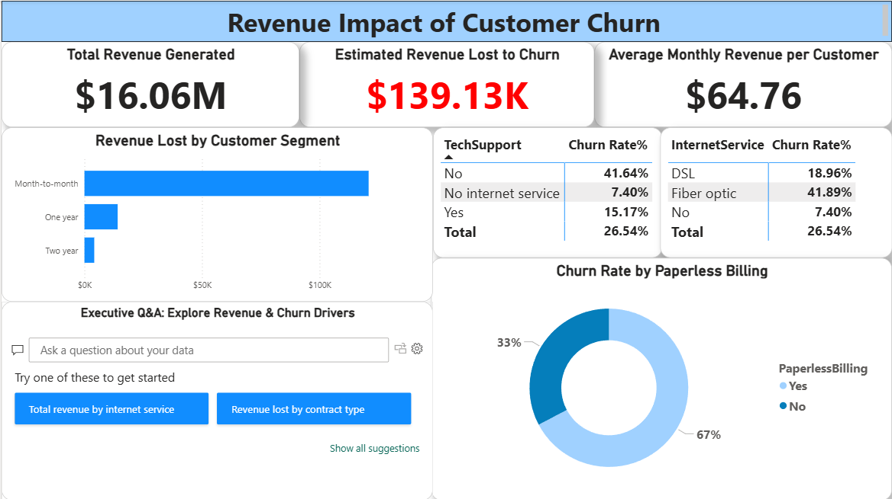

# 📞 Databel - Customer Churn Analysis

### 📊 Project Overview
**Goal:** Analyze customer churn behavior for "Databel" (a fictional telecom provider) to identify why customers are leaving and how to reduce the 26.5% churn rate.
**Tools:** Power BI, Power Query, DAX.

---

### 🖼️ Dashboard Visuals

**Page 1: Overview & Churn Drivers**

*Provides a high-level view of the churn rate (26.5%) and splits by contract, payment method, and demographics.*

**Page 2: Revenue & Service Impact**

*Analyzes the financial impact of churn ($139K/month lost) and investigates specific services like Fiber Optic and Tech Support.*

---

### 🔎 Key Insights & Business Recommendations

#### 1. The "Contract" Trap
* **Insight:** Customers on **Month-to-Month contracts** have an alarming churn rate of **42%**, compared to just **3%** for Two-Year contracts.
* **Recommendation:** Incentivize long-term contracts by offering a discount (e.g., "First month free on 1-year plans") to migrate users away from the volatile month-to-month model.

#### 2. The "Fiber Optic" Paradox
* **Insight:** Fiber Optic is our premium service, yet it has the highest churn rate (**41.8%**) compared to DSL (**19%**).
* **Recommendation:** This signals a quality or pricing issue. Urgent investigation is needed into Fiber Optic service reliability and competitor pricing in key regions.

#### 3. Support is a Retention Driver
* **Insight:** Customers *without* Tech Support churn at **41%**, while those *with* Tech Support churn at only **15%**.
* **Recommendation:** Offer a "Free Tech Support" trial for high-risk customers (Month-to-Month + Fiber Optic users) to lock them in.

#### 4. Financial Impact
* **Revenue at Risk:** We are currently losing **$139,000 per month** in recurring revenue.
* **Target Segment:** The highest financial loss comes from Month-to-Month customers paying via Electronic Check.

---

### 🛠️ Technical Details
* **Data Processing:** Cleaned `TotalCharges` (converted to numeric), standardized `SeniorCitizen` values, and created a `Tenure Group` column for cohort analysis.
* **Complex DAX Measures:**
    * **Churn Rate:** `DIVIDE([Churned Customers], [Total Customers])`
    * **Revenue Lost:** `CALCULATE(SUM(MonthlyCharges), Churn="Yes")`
    * **Active Customer Count:** Used `DISTINCTCOUNT` to validate unique IDs.
    * **Churned customers = `CALCULATE(COUNTROWS(Teleco_Churn_Analysis), Teleco_Churn_Analysis[Churn]="yes")`
